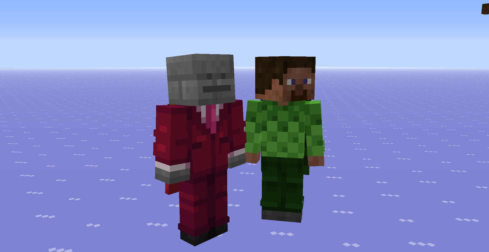

# Reskin for Forge 1.7.10
This mod backports the skin format from 1.8+.
 It also loads skins/capes from player names instead of `GameProfile`s. Why? because this mod was made for Historical SMP, which is running on MC 1.7.4, a version that doesn't send `GameProfile` info to the clients.

## Caching
The client caches all the `GameProfile`s after loading them so you don't have to load them every time. If you want to reset this cache, hit `F3 + R`. This is also useful to update your skin without restarting your client.

## Configuration
You can go to the mod options section and configure the mod. Currently, the only option available is `transparency`, which allows skins to be translucent.

## Dependency
> [!IMPORTANT]
> This mod needs a Mixin bootstrap mod to work.

My recommendation is [UniMixins](https://modrinth.com/mod/unimixins). Other Mixin bootstrap mods will work too.

## Credits
This mod is heavily inspired/based on SkinPort:
 🔗 https://github.com/zlainsama/SkinPort
